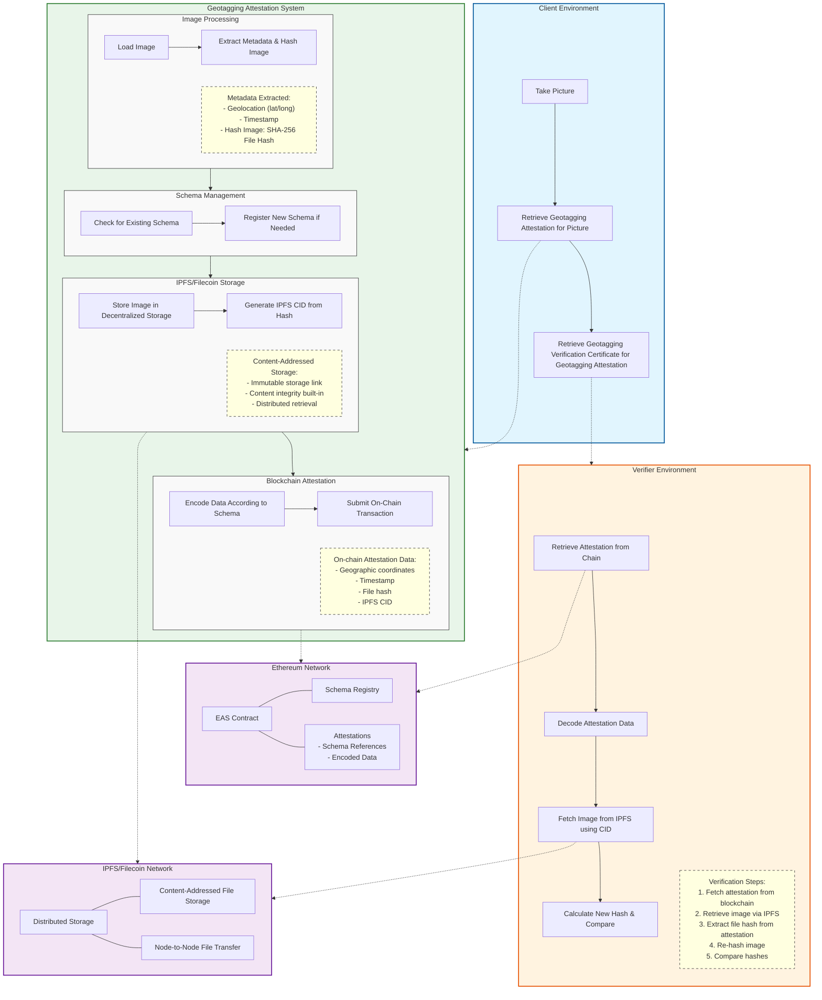

# Geotagging Attestation-based Verification System: Detailed Workflow

This document outlines the detailed workflow for the Geotagging attestation system, which enables verifiable image integrity and geolocation attestation through blockchain.

## Workflow Diagram




## Technical Implementation Details

### 1. Schema Management
- **Schema Definition**: `string latitude, string longitude, uint64 timestamp, string fileHash, string ipfsCid`
- **Schema UID Calculation**: Deterministic hash of schema string + resolver address + revocability flag
- **Schema Registration Process**:
  ```typescript
  // First verify if schema exists in registry
  const existingSchemaUID = await checkExistingSchema(schemaString, resolverAddress, revocable);
  if (!existingSchemaUID) {
    // Create schema registration data
    const schemaData = { schema: schemaString, resolverAddress, revocable };
    // Register schema on-chain using signer wallet
    schemaUID = await registerSchema(signer, schemaData);
  }
  ```

### 2. Image Processing and Cryptographic Hashing
- **File Loading**: `const imageData = fs.readFileSync(imagePath);`
- **Metadata Extraction**: In production, would extract EXIF data
- **Hash Generation**:
  ```typescript
  // Create SHA-256 hash of entire file contents
  const fileHash = sha256(imageData.toString('hex'));
  // This creates a unique fingerprint that changes if even 1 bit of the file is modified
  ```

### 3. IPFS Content Addressing
- **Content Identifier Creation**:
  ```typescript
  // In production: Upload to IPFS and get CID
  // In simulation: Generate mock CID from hash
  const mockIpfsCid = "ipfs://Qm" + imageData.fileHash.substring(0, 44);
  ```
- **Content-Addressed Storage**: The IPFS CID is derived from the content itself, ensuring content integrity

### 4. Blockchain Attestation Creation
- **Data Preparation**:
  ```typescript
  const attestationData = {
    // Recipient address (who the attestation is for)
    recipient: finderAddress,
    // Attestation never expires
    expirationTime: 0n,
    // Can be revoked if needed
    revocable: WORKFLOW_CONFIG.revocable,
    // Reference to schema structure
    schemaUID: schemaUID,
    schemaString: WORKFLOW_CONFIG.schemaString,
    // Actual data to be stored on-chain
    dataToEncode: [
      { name: "latitude", value: imageData.latitude, type: "string" },
      { name: "longitude", value: imageData.longitude, type: "string" },
      { name: "timestamp", value: BigInt(imageData.timestamp), type: "uint64" },
      { name: "fileHash", value: imageData.fileHash, type: "string" },
      { name: "ipfsCid", value: mockIpfsCid, type: "string" },
    ],
  };
  ```
- **Transaction Creation and Submission**: 
  ```typescript
  // This encodes the data according to the schema and submits the transaction
  const newAttestationUID = await createOnChainAttestation(signer, attestationData);
  ```

### 5. Independent Verification Process
- **Attestation Retrieval**: `const fetchedAttestation = await getAttestation(newAttestationUID);`
- **Data Decoding**:
  ```typescript
  const schemaEncoder = new SchemaEncoder(WORKFLOW_CONFIG.schemaString);
  const decodedData = schemaEncoder.decodeData(fetchedAttestation.data);
  ```
- **Hash Extraction**:
  ```typescript
  // Extract the attested file hash
  let attestedFileHash = "";
  for (const field of decodedData) {
    if (field.name === "fileHash") {
      attestedFileHash = field.value.value as string;
      break;
    }
  }
  ```
- **File Retrieval and Verification**:
  ```typescript
  // In production: Retrieve file from IPFS using CID
  // In simulation: Read local file
  const retrievedIpfsImageData = fs.readFileSync(sampleImagePath);
  const verifierCalculatedHash = sha256(retrievedIpfsImageData.toString('hex'));
  
  // Compare original hash with newly calculated hash
  const isVerified = attestedFileHash === verifierCalculatedHash;
  ```

## Security and Trust Properties

1. **Proof of Existence**: The blockchain timestamp proves when the attestation was created
2. **Proof of Integrity**: The file hash proves the content hasn't been modified
3. **Proof of Location**: The geographic coordinates are permanently linked to the image
4. **Proof of Attribution**: The blockchain signer's identity is cryptographically linked to the attestation
5. **Decentralized Verification**: Any party can independently verify all claims without trusting the original source
6. **Tamper-Evidence**: Any modification to the image results in a completely different hash

The combination of blockchain attestations and content-addressed storage creates a verification system that can be used as evidence in journalism, legal proceedings, insurance claims, scientific research, and other applications requiring proof of image authenticity and origin.