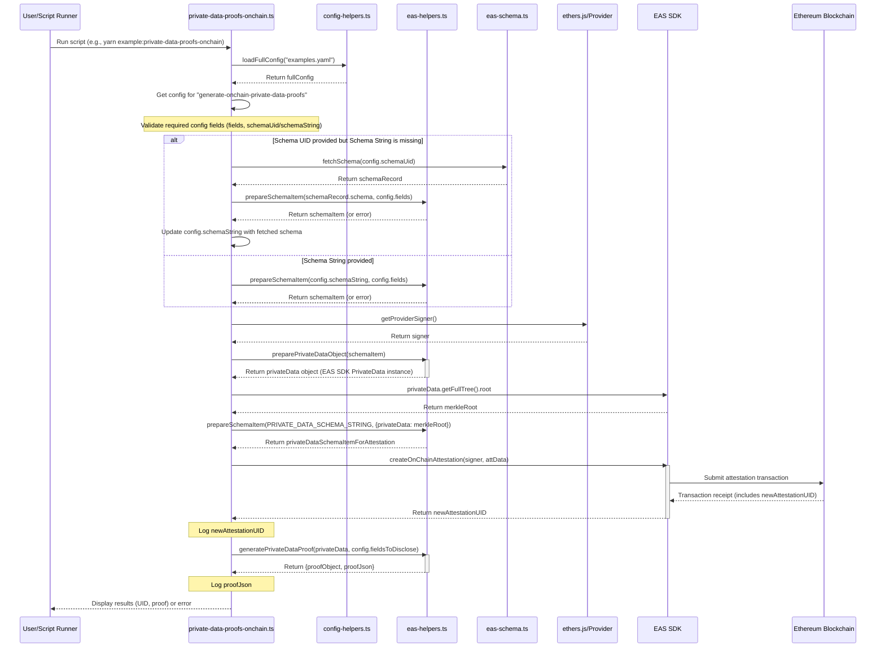
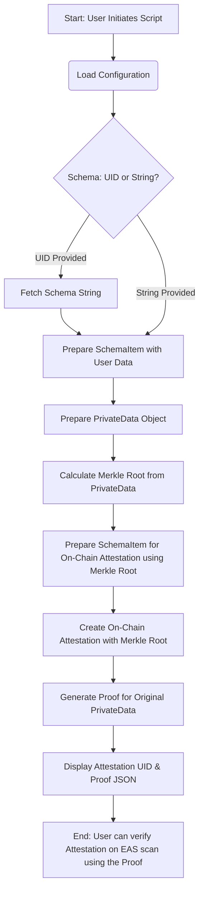

# Diagrams and Flowcharts

## Private Data Proofs On-Chain

### Sequence Diagram Script Execution

This sequence diagram illustrates the sequence execution of the `private-data-proofs-onchain.ts` script, detailing how it interacts with various components to generate and submit private data proofs on-chain.

## Data journey Flowchart

This flowchart outlines the data journey from the user's input to the final on-chain attestation and proof generation. It highlights the key steps involved in processing the private data and creating the necessary attestations.

