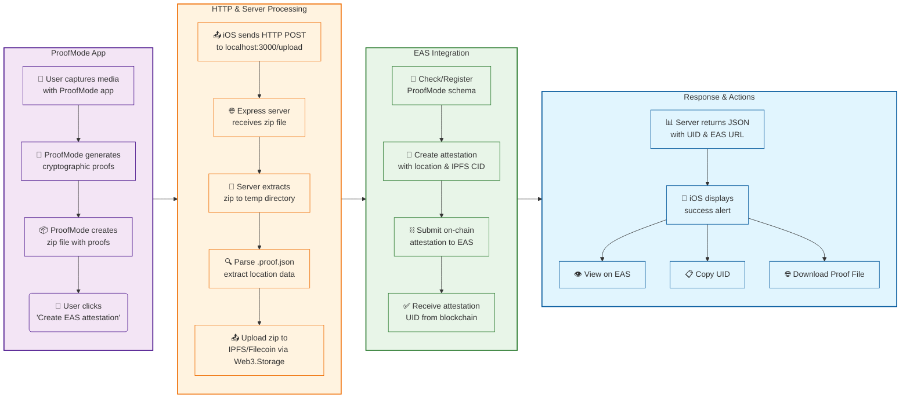

# ProofMode EAS Integration

Connect [ProofMode iOS app](https://gitlab.com/guardianproject/proofmode/proofmode-ios/-/tree/2865bd9a1a4f3b4d757f6ed0cae45e75c1e6621f) with Ethereum Attestation Service (EAS) to create permanent blockchain attestations for location-verified media captures.

## 🎯 What This Integration Does

**[ProofMode](https://proofmode.org/)** generates cryptographic proofs when users capture photos/videos, including location data, device signatures, and timestamps. This integration adds blockchain permanence by creating **EAS attestations** that can be publicly verified.

**Key Benefits:**
- 🔗 **Permanent Records**: Location proofs stored on blockchain, not just device
- 🗄️ **Decentralized Storage**: Complete ProofMode packages uploaded to IPFS/Filecoin via Web3.Storage
- 🔍 **Public Verification**: Anyone can verify authenticity via EAS explorer and access original files via IPFS/Filecoin
- 📱 **Seamless Experience**: One-tap attestation creation from ProofMode share menu
- 🛡️ **Zero Breaking Changes**: All original ProofMode functionality preserved

## 🚀 Quick Start

1. **Start the server:**
   ```bash
   # From eas-sandbox root directory
   yarn server:proofmode
   ```

2. **Use the iOS app:**
   - Capture media with ProofMode as usual
   - Tap share → "Create location attestation (EAS)"
   - View attestation on EAS blockchain explorer

## 🏗️ Architecture

The integration consists of two main components working together:

**iOS App Integration** → **HTTP Server** → **EAS Blockchain**

Built upon the original [`workflow-proofmode.ts`](../src/workflows/workflow-proofmode.ts), this system accepts ProofMode zip uploads via HTTP and returns structured attestation data.

### Workflow Overview



## 📁 Components

This integration has two main components:

### 📱 iOS Integration  
Modified ProofMode app with a new "Create location attestation (EAS)" button in the share menu. Zero breaking changes to original functionality.

**[→ iOS Implementation Details](ios/README.md)**

### 🌐 HTTP Server  
Express server that processes ProofMode zip files and creates EAS attestations. Provides RESTful API at `localhost:3000/upload`.

**[→ Server Implementation Details](server/README.md)**

## 🛠️ Technical Summary

**Data Flow:** ProofMode ZIP → HTTP API → IPFS/Filecoin Upload → EAS Blockchain → Response with attestation UID & IPFS CID  
**Storage:** Decentralized via Web3.Storage (IPFS/Filecoin)  
**Network:** Sepolia testnet (configurable)  
**Upstream Source:** [ProofMode iOS ActivityView.swift](https://gitlab.com/guardianproject/proofmode/proofmode-ios/-/blob/2865bd9a1a4f3b4d757f6ed0cae45e75c1e6621f/Proofmode/ActivityView.swift)